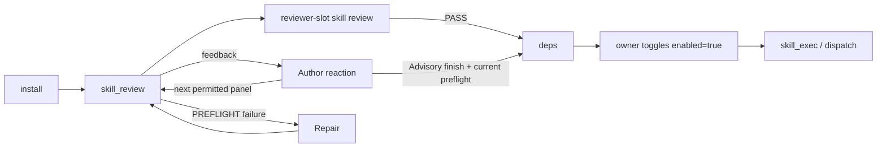

# Creating Skills for Ouroboros

This is the practical guide for **writing your own skills** that
Ouroboros can install, review, enable, and execute. It is the
single place where the manifest schema, the `PluginAPI`, the review
checklist, the lifecycle (install → review → enable → execute), the
widget render schemas, and the marketplace publishing flows are
explained together.

If you are looking for the *runtime* architecture (how the loader
imports plugins, how the tri-model review pipeline is wired, etc.),
read [`docs/ARCHITECTURE.md`](ARCHITECTURE.md). If you want to know
exactly what a reviewer model is asked to check, read the "Skill
Review Checklist" section of [`docs/CHECKLISTS.md`](CHECKLISTS.md).

## What is a skill?

A **skill** is a small package that adds capabilities to Ouroboros:
new tools the agent can call, HTTP routes the desktop app can fetch,
WebSocket message handlers, and host-rendered widget UIs. Skills are
**reviewed** before they can run. Skills dropped in from disk or
marketplaces go through tri-model review and explicit owner lifecycle
actions. Skills authored by the current Ouroboros agent session carry
both payload-local `.self_authored.json` and owner-state
`data/state/skills/<name>/self_authored.json` markers for provenance,
but they still go through the same tri-model skill review before they
can run.

**Owner attestation (skip review for your own or verified official skill).** For
an external or self-authored skill, and for a hash-verified official
OuroborosHub payload, the OWNER may skip the expensive LLM review via the
**⚠️ Skip review** action on the skill card (owner-only
`POST /api/owner/skills/{skill}/attest-review`). The deterministic preflight +
manifest-validation floor STILL runs (an invalid or unsafe payload is refused),
and official-hub payloads are freshly rechecked against the live catalog before
attestation is persisted. Only the tri-model LLM phase is skipped; the verdict
is marked `owner-attested` (distinct from an LLM-clean badge) and does not
confer publication readiness. Choosing Publish may still start the ordinary
managed publication task, but attestation alone authorizes no outbound GitHub
effect. Publication needs fresh critic authority or a later actual independent-review
outcome acknowledged through qualified Advisory author finish (see Publishing). Native, ClawHub, and unverified
OuroborosHub payloads are never attestable. The agent cannot self-attest (the
marker is owner-state).

There are three skill types:

| Type | What it ships | When to use |
|------|---------------|-------------|
| `instruction` | Markdown-only `SKILL.md` (no code). | Pure prompts / playbooks for the agent. |
| `script` | One or more scripts under `scripts/` plus a manifest. | Heavy / batch work that runs as a subprocess. |
| `extension` | A `plugin.py` that registers tools/routes/widgets via `PluginAPI`. | Host-integrated capabilities, including widgets and chat-driven tools; native-risk isolated deps dispatch in short-lived child processes. |

The **runtime ownership** of an installed skill is also tagged:

- `native`: bundled with the launcher (e.g. `unix_computer_use`).
- `self_authored`: created by Ouroboros itself in the current data
  plane; marked by `.self_authored.json` and reviewed through the
  standard tri-model skill-review path.
- `external`: dropped into `data/skills/external/` by the user.
- `clawhub`: installed via the ClawHub marketplace.
- `ouroboroshub`: installed via the official OuroborosHub catalog.

User-authored or manually copied skills belong under
`data/skills/external/<name>/`. The `native` bucket is reserved for
launcher-seeded skills that carry a `.seed-origin` marker. That marker, not the
directory name alone, is the ownership fact: an existing payload under
`native/` without the marker is treated in place as user-managed `external`
content. Ordinary top-level tasks can inspect, edit, run commands in, or
delegate that payload without a migration. A marker-present launcher seed stays
read/review-only, and new skills are still created under `external/`.

## Manifest schema (`SKILL.md` frontmatter or `skill.json`)

A manifest is YAML frontmatter inside `SKILL.md`, OR a standalone
`skill.json`. Both shapes parse to the same dataclass. Use whichever
fits your editing workflow.

```yaml
---
name: weather                       # required, alnum/underscore/dash, ≤64 chars
description: Live weather widget    # required, short summary
version: 0.2.1                      # required, free-form (semver recommended)
type: extension                     # instruction | script | extension
runtime: python3                    # script skills: python/python3/bash/node/deno/ruby/go; extension entry modules are Python plugin.py
entry: plugin.py                    # type=extension only — relative to skill dir
scripts:                            # type=script only
  - name: fetch.py                  # name resolves under scripts/ unless slashes/extensions
    description: Fetch and render
permissions: [net, tool, route, widget, read_settings, companion_process, supervised_task] # see "Permissions"
conflicts: [legacy-weather]            # optional incompatible installed skill names
env_from_settings: [OPENROUTER_API_KEY]                  # core keys require an owner grant
when_to_use: User asks for the weather forecast.
model_experience:                   # optional prose (CPL-7); a bare string is also accepted
  what_model_sees: One weather tool joins the tool list; results come back as compact JSON.
  token_effect: Small fixed schema cost per round while enabled.
timeout_sec: 60                     # default 60, hard cap 300
companion_processes:                # optional; PLURAL, and needs the companion_process permission
  - name: demo_worker               # see "Declaring a companion process"
    command: [python3, scripts/worker.py]
    runtime: python3
scheduled_tasks:                    # optional reviewed cron jobs
  - name: refresh-cache
    cron: "0 * * * *"                # 5-field cron, host-local timezone by default
    timezone: Europe/Moscow          # optional IANA timezone override
    description: Refresh shared weather cache hourly.
ui_tab:                             # extension widgets (optional)
  tab_id: live
  title: Weather
  icon: "⛅"                        # one glyph (emoji / symbol); a name like `cloud` is not rendered
  render:
    kind: declarative
    start: auto                     # launch policy; module/iframe may say manual | retain (see "Launch policy")
    schema_version: 1
    components:
      - type: form
        route: search
        method: POST
        target: result
        fields:
          - name: city
            label: City
            type: text
        submit_label: Refresh
      - type: kv
        target: result
        fields:
          - label: Temperature
            path: temp_c
---

# Weather

Markdown body explaining the skill to the user / reviewer / agent.
Everything below the closing `---` becomes `manifest.body`.
```

`runtime` is optional for `type: instruction` (instruction skills never
execute), and required for `script` / `extension`. Allowed values are
`python`, `python3`, `bash`, `node`, plus the v5.7.0 additions
`deno`, `ruby`, `go`. The actual binary is resolved through
`shutil.which` at exec time, so the operator's host must ship the
runtime; otherwise `skill_exec` fails closed with a clear error.

Go scripts are compiled into a private temporary executable and then run with
the caller's arguments unchanged, including arguments ending in `.go`. The
compiler and program share the invocation timeout; `runtime_phase` distinguishes
a compilation failure from the program's own exit status. Cleanup uses the same
tracked-process path as the other script runtimes.

Deno receives `run --no-prompt` and permissions before the script operand.
Ordinary reads remain available; `fs` permits writes outside the existing skill
state directory, `net` permits network calls unless the task disables network,
and `subprocess` permits child processes. Environment access names only the keys
actually forwarded after grants. A task with network disabled also requires
cached imports. These are the existing reviewed script effects, not a new OS
sandbox: in particular, an allowed child process has ordinary host privileges.

`conflicts` is an optional list of canonical skill names (letters, numbers,
dash, underscore, or dot; at most 32 entries). If either enabled skill names
the other, both readiness and extension loading fail closed with a typed
conflict until the owner disables one. Ouroboros never resolves a conflict by
automatically disabling, deleting, or moving either payload.

`model_experience` is an optional prose section describing the skill from the
model's point of view: `what_model_sees` (what the skill adds to the model's
context — tools, sections, attachments) and `token_effect` (roughly what that
costs and when it is loaded). A bare string is shorthand for
`what_model_sees`. The prose travels verbatim (bounded) to the model-visible
surfaces — the `list_skills` JSON and the "Installed Skills" context section —
so write it for the model, not for the human reviewer. Unknown keys or
non-string values are refused at parse time.

Manifest refusals teach: every `SkillManifestError` carries the problem plus,
where the parser knows the repair, a `fix_hint` rendered into the message
(`... — fix: ...`), so a refused registration tells you how to fix the
manifest instead of only what was wrong.

## Lifecycle: install → review → enable → execute



- **Install** lands the payload under the appropriate bucket
  (`data/skills/<bucket>/<name>/`). Marketplace installs also write
  a provenance sidecar (`.clawhub.json` / `.ouroboroshub.json`).
- **Review** runs three reviewer models in parallel against the
  Skill Review Checklist (see [`docs/CHECKLISTS.md`](CHECKLISTS.md)).
  The review pack hashes every runtime-reachable file in the skill
  directory; any later edit stales that critic verdict. `.self_authored.json`
  is provenance only; self-authored skills use the same tri-model review,
  grant, enable, and extension reload flow as other executable skills.
- **Isolated deps** (pip / npm / uv / node) install into
  `data/skills/<bucket>/<name>/.ouroboros_env/`. Status is recorded
  in `data/state/skills/<name>/deps.json`.
  In-process extension scopes are non-reentrant: no-dependency handlers of
  DIFFERENT skills share a read lease and overlap, the handlers of ONE skill
  run one at a time (your callbacks stay sequential, as under the old
  exclusive lock), and a dependency-bearing handler owns an exclusive lease
  through import, handler waits and cleanup. The async form polls
  cooperatively, so it never blocks the ASGI loop; nested scopes and
  unwrapped child work remain unsupported rather than inheriting a lease.
- **Enable** flips `enabled.json` after current executable-review authority + grants + deps. The
  Skills UI surfaces a toggle; agents can also call `toggle_skill`.
  A self-authored skill's first enablement can follow
  `OUROBOROS_AUTO_GRANT_REVIEWED_SKILLS`; otherwise enabling requires the owner
  toggle or an agent acting on the owner's expressed instruction.
- **Execute**: `skill_exec` runs `type: script` skills as
  subprocess. `type: extension` skills without isolated deps normally run
  through the in-process loader; extensions with reviewed isolated deps are
  cataloged and dispatched in short-lived child processes so a dependency crash
  or Rust/C abort cannot crash the server.

## Data layout for stateful skills

Stateful skills should keep every user-visible job/session isolated under a
per-job directory. For extensions, prefer:

```python
job_dir = api.skill_job_dir(job_id)
assets_dir = job_dir / "assets"
output_dir = job_dir / "output"
tmp_dir = job_dir / "tmp"
```

This creates `data/state/skills/<skill>/jobs/<sanitized_id>-<hash>/{assets,output,tmp}`.
Use it for generated images, audio, video frames, intermediate artifacts, and
per-request temp files. Keep shared learned data such as prompt lessons or
small caches at the skill state root only when it is intentionally shared across
jobs.

Avoid flat content-keyed filenames such as `assets/keyframe_0.png`,
`concat.txt`, or `_vframe_0.png` directly under `state_dir`; a later or
parallel job can overwrite them. Retry outputs should include an attempt number
or short random suffix, and temporary verification files should live under
`tmp/` and be cleaned when the job finishes.

### Declaring dependencies

Skills may declare auto-installable dependencies in frontmatter:

```yaml
dependencies: [ddgs]
```

or with explicit install specs:

```yaml
install:
  - kind: pip
    package: ddgs
```

Bare `dependencies` entries are treated as Python packages. `pip`,
`pipx`, `uv`, `npm`, and `node` specs are installed only after a fresh
executable review and only under the skill's `.ouroboros_env` directory.
Global package-manager specs remain manual setup guidance. Exact resources and
explicit build actions use the same isolated install owner:

```yaml
install_specs:
  - kind: download
    url: https://example.org/application/disk.img
    # Replace both with the publisher's exact artifact facts.
    sha256: "0000000000000000000000000000000000000000000000000000000000000000"
    size_bytes: 9437184
    version: application-data-1
    target: resources/disk.img
    platforms: [linux, darwin, win32]
```

`target`, step `cwd`, and `outputs` are relative to `.ouroboros_env` and must
remain inside it. Platform names are `sys.platform`, optionally followed by
`-` and the lowercase `platform.machine()` value (for example,
`linux-x86_64` or `darwin-arm64`); omitted `platforms` applies everywhere.
An inapplicable entry is recorded as skipped. Resources are verified by size
and digest before landing; no package-size cap is borrowed for this file path.
The content-addressed resource and package caches live under
`state/skills/<name>/dependency_cache/`, outside the replaceable payload/env.
Replacing the environment or retrying therefore reuses verified downloaded
bytes; a different digest selects a different cache entry.

An entry may also declare `steps: [{argv: [...], cwd: "."}]`, `outputs:
["bin/helper"]`, and `check: {argv: ["helper", "--version"]}`. Arguments stay
literal; no shell interpolation is performed. Steps require outputs and a
concrete successful check; declared `bins` must resolve after installation.
Build tools use the existing process tracking, timeout and cancellation path.
The normal installer invokes new downloads/build declarations only against
their fresh executable review and hash-covered specs, rechecking the pinned
payload before each build/check process.

Python `allow_source_build: true` and npm `allow_install_scripts: true` opt in
per entry, each with a declared `check`. Without those flags pip remains
wheel-only and npm keeps `--ignore-scripts`. An already installed npm package
can be rebuilt explicitly on retry without rebuilding unrelated packages.
`deps.json` records resource digests, actual resolved package metadata,
output hashes and build diagnostics. `installed` records delivery;
`executable_ready` is unknown without a declared check and true only after
that check succeeds. A failed check stays failed, even if the package manager
returned zero. Manual dependencies do not acquire a new universal probe gate.

For `type: extension`, any reviewed isolated dependency env is kept out of
`server.py`: `plugin.py` cataloging and tool/route/WS handlers run in a
short-lived child process with the skill's payload and isolated env. Child
crashes surface as tool errors, HTTP 502 responses, or WebSocket log messages;
the server and WebSocket stay alive. Opaque native files shipped directly in the
payload are still review-sensitive; if such a marker exists, the runtime also
uses child dispatch defensively, but this guide does not make native payload
binaries broadly acceptable.
Out-of-process extensions have near full PluginAPI parity. They proxy tools, HTTP
routes, WS handlers, UI tabs, and settings sections; `on_unload` runs at child
teardown; `send_ws_message` relays to the browser through the Host Service
`POST /ui/ws-message` bridge; and `register_companion_process` is cataloged so the
host spawns and supervises a long-lived companion for background work. Only two
capabilities have no meaning in a short-lived per-call child and stay unavailable
there: `subscribe_event` and `register_supervised_task` (an in-process asyncio
task). For long-running work, host-event subscription, or live progress that must
outlast a single call, declare a `companion_process` — a host-supervised
subprocess that already receives `HOST_SERVICE_URL`/`HOST_SERVICE_TOKEN` and can
call `POST /ui/ws-message` and connect to `WS /events`. A skill can read
`get_runtime_info()["execution_mode"]` and `["capabilities"]` to adapt instead of
calling an unavailable capability and aborting registration.

Out-of-process caveats: (1) `register()` and `on_unload` run for **each per-call
child** (every tool/route/WS dispatch and catalog), so `on_unload` fires per call,
not once per disable — keep it cheap and idempotent and put durable/once-per-session
teardown in a `companion_process` shutdown. (2) `send_ws_message` relays through the
loopback Host Service and is best-effort: the relay lane holds a 60-message burst
reserve per skill that refills one message per second, the excess is refused (a 429
with `retry_after_sec`; the host records each refused burst once with its dropped
count), so a progress-heavy job should throttle updates or rely on poll-based
status. Successful children also return aggregate transport/HTTP refusal counts
through their normal result/process diagnostics; `send_ws_message` still returns
`None`, and acceptance does not prove browser delivery. (3) A
`companion_process` is spawned and supervised by the host **server** process: enabling
a companion skill from the agent's `toggle_skill` tool or via post-review auto-enable
records it in the worker process and writes a durable
per-request marker under `state/extension_reconcile/` (filename includes a safe
skill prefix plus request id). The server pickup task consumes that marker and
starts/stops registered companions shortly after; the UI/HTTP
enable still starts them immediately because it runs inside the server. Design
companions to tolerate this small asynchronous handoff.

### Scheduled skill tasks and daemons

Skills may declare reviewed cron jobs in `scheduled_tasks`. A scheduled task is
not a hidden daemon: it is a reviewed schedule entry that the core supervisor
turns into ordinary queued work using the same task queue, logs, timeout, and
review-visible provenance as other work. The first supported syntax is standard
5-field cron (`minute hour day month weekday`), with host-local timezone by
default and optional per-task IANA timezone override. If Ouroboros was offline
when a cron became due, the scheduler performs one catch-up run rather than
replaying every missed occurrence.

In v1, a skill scheduled task is an agent-visible reminder to run the reviewed
skill task by name; the agent still chooses the correct `skill_exec` or extension
surface at execution time. Deterministic script/route targets can be added as a
future manifest extension once the schedule lifecycle has stabilized.

Long-running processes are still represented by extension companion processes,
not by `start_service`. `start_service` is task-scoped and is stopped when the
owning task ends. Companions require reviewed manifest declarations and the
`companion_process` permission; scheduled tasks require review-visible manifest
metadata and the `supervised_task` permission.

### Declaring a companion process

The descriptor lives in the manifest; `plugin.py` only names it. The key is
`companion_processes` — **plural** — and `register_companion_process()` accepts
only that name (positionally or by keyword):

```yaml
permissions: [companion_process]
companion_processes:
  - name: demo_worker                     # alnum/underscore only, max 24 chars
    command: [python3, scripts/worker.py] # relative POSIX-style path in the skill
    runtime: python3
    restart_policy: on_failure            # default; the only policy that restarts
    max_restarts: 5                       # default; the bound within a 300s window
```

```python
def register(api):
    api.register_companion_process("demo_worker")   # only the declared name
```

Two different layers check this, and they fail at different moments. The parser
rejects a malformed descriptor when the skill is read:

| Rule | Error when broken |
|---|---|
| `name` is present and non-empty | `each 'companion_processes' item must include name` |
| `command` is present and non-empty | `each 'companion_processes' item must include a non-empty command list` |
| `runtime` is declared | `each 'companion_processes' item must include runtime` |
| A `python`/`python3` runtime names a script — a bare `[python3]` does not | `python companion command must name a reviewed script` |
| No argument is `-c`, `-m`, `-e`, `--eval` or `eval`. `[python3, -m, mypackage, boot]` is caught here rather than by the rule above, even when the package is a declared dependency — and so is a script of your own passed a flag that happens to be named `-c` | `companion inline/eval commands are not allowed` |
| Path arguments use relative POSIX-style paths (no leading `/` or `..` segment) | `companion command arguments must stay inside the reviewed skill tree` |

The path check is lexical and does not verify that the target file exists. Keep
the script in the skill payload and use `/` separators so the descriptor has the
same meaning on every supported platform.

Registration then checks the manifest permission, the name constraints that the
parser does not enforce, and whether the name is declared. A manifest that has
passed parsing but is wrong in these ways fails from `plugin.py`:

| Rule | Error when broken |
|---|---|
| The manifest includes the `companion_process` permission | `skill 'x' cannot 'companion_process' — manifest permissions=[...]` when it is missing |
| `name` is at most 24 characters | `tool name must be <= 24 characters: '...'` |
| `name` contains only alnum/underscore — `demo-worker` parses in the manifest but is not a registrable name | `tool name must be alnum/underscore only: 'demo-worker'` |
| The name passed to `register_companion_process()` is declared in the manifest | `companion 'x' is not declared in manifest.companion_processes` |

**If you read that last error, check the key for a missing `s` first.** An
unrecognised frontmatter key is kept as an extra rather than refused —
`install_specs` and the forward-compatible `presence:` block are both read that
way — so `companion_process:` in the singular parses, declares no companions,
and currently produces no warning from the parser, `validate()`, or
`skill_preflight`. The error you eventually meet names the
plural key and cannot tell you that the singular one was sitting in the
manifest all along.

There is no `on_enable` trigger and no `once` flag. After a skill is enabled, the
host starts a companion whose name `register()` has registered; for an
out-of-process extension, this handoff can be asynchronous. The companion is
supervised from there; `restart_policy: on_failure`
restarts it only on a non-zero exit, so a one-shot script that exits 0 runs
once, and `max_restarts` (default 5, counted within a 300-second window) bounds
the loop before `companion_restart_exhausted` is recorded. For work that must
happen before the first tool call, remember that an out-of-process extension
already runs `register()` in every per-call child — see the out-of-process
caveats above — so cheap idempotent setup belongs there, not in a companion.

`env` and `ports` may also be declared on the descriptor. Neither is passed
through as written: the host drops `HOST_SERVICE_TOKEN`, `HOST_SERVICE_URL` and
any forbidden settings key out of `env` (and sets the first two itself), and it
keeps only all-digit entries from `ports`, so a negative or non-numeric one is
dropped in silence.

## The `skill_preflight` tool

When you are writing or repairing a skill,
`skill_preflight` runs cheap, offline syntax validators on the
payload — in-process Python `compile()` for `.py` files (no
`__pycache__` writes), `node --check` for `.js`/`.mjs`/`.cjs` (a
declared module-widget entry is instead parsed as a classic script, the
grammar the widget frame runs it in, so top-level `import`/`export` in the
entry fails preflight),
`bash -n` for `.sh`/`.bash`, plus a manifest parse, explicit
entry/script existence checks (including a module widget's `render.entry`
existence and containment), and static widget render-schema
validation. It validates manifest `ui_tab.render` plus actual
`register_ui_tab` and `register_settings_section` calls in `plugin.py`
through the same runtime validator as `extension_loader`. The static
resolver accepts an inline literal, a module-level literal assignment, or a
simple local zero-argument helper with an optional docstring and one
literal/resolvable return. It never imports or executes the plugin and does not
interpret eval, comprehensions, or merges. A schema it can resolve but that is
invalid fails preflight; an unresolved dynamic registration is recorded as
`verified=false`, `skipped=true`, `skip_reason=dynamic_ui_schema` with its source
reference, while runtime registration remains the final fail-closed validator.
One frozen compatibility exception is intentionally asymmetric: deterministic
preflight reports an iframe declaration with an omitted `route` as invalid,
while runtime registration preserves that route-less shape so an existing
extension still loads (the card remains not-supported rather than executable).
It does not call any LLM and does not mutate review state, so the agent can
iterate without burning review tokens.

```text
skill_preflight(skill="weather")
skill_preflight(skill="weather", paths=["plugin.py"])
```

## Repair task path scheme and edit tools

**Repair and run** from the Skills or Marketplace UI starts an ordinary managed
development task. The confirmed request is retained as a real owner message, not
a presentation-only acknowledgement. Its normal task constraint records the selected skill and physical payload
root; the task also retains the request source and initial content revision.
Persisted `mode="skill_repair"` task records remain readable with the same ordinary
tool capabilities. Payload-relative paths address the selected installation:

| Tool | Repair path example | Use when |
|------|---------------------|----------|
| `read_file` / `list_files` with `root=skill_payload` | `plugin.py`, `scripts/main.py` | Inspect payload files. |
| `edit_text` with `root=skill_payload` | `plugin.py` | One exact replacement in an existing file. |
| `write_file` with `root=skill_payload` | `new_module.py` | New files or intentional full-file rewrites. |
| `skill_preflight` | `skill="weather"` | Cheap read-only syntax/schema check before LLM review. |
| `skill_review` | `skill="weather"` | Review the changed payload before execution. |

The task retains ordinary shell, browser, search, delegation and execution tools.
The installed payload is usually a normal directory; an isolated Git copy through
delegation is optional. Selected payload operations check the known revision;
after an opaque shell command the task records the observed revision without
claiming every concurrent change as its own.

Test the repaired installation through its real script, extension tool, HTTP
route, widget or companion after the normal review, dependencies and permissions
checks. Review does not forcibly unload a working extension. Inspect widget
screenshots and repeat the edit/review/execution cycle when fixes are needed.

Repair and run authorizes enabling and testing the repaired installation, leaving
it working. After review, the model calls `toggle_skill`; the host resolves the
task's actual original owner message by default. A later direct owner disable
requires a newer owner instruction. Repair does not authorize granting all
permissions, attestation or deletion. Existing auto-grant policy still applies. `skill_owner_action` uses the shared lifecycle owners only with the
specific action, revision and existing owner-intent source; a source reference
alone is not permission. An automatic edit-and-review request retains
`allow_enable=False` and does not gain enablement authority from being a Repair.

### Top-level short-form authoring (including light mode)

An ordinary top-level task in every runtime mode can target user-managed skill
payloads with `root=skill_payload`, `bucket` (`external` / `clawhub` /
`ouroboroshub` / `user_repo`), and `skill_name`. A markerless payload physically
under `native/` is selected through the logical `external` bucket; a true
marker-present native seed remains read/review-only. A short relative
`path` such as `plugin.py` or `lib/utils.py` resolves under
the selected physical payload root. Supply both args together — passing only
one returns a clear
`bucket and skill_name must be supplied together` error instead of silently
writing into the drive root.

The selected-skill constraint keeps payload-relative calls attached to their
declared physical skill. Ordinary development capabilities remain available;
selecting another payload is not an implicit redirect of this task's target.

To **create a new skill** the payload directory need not pre-exist: writing the
manifest at the payload root (`path="SKILL.md"` or `path="skill.json"`) is the
authoring signal and provisions the new payload (and marks it `self_authored`).
A non-manifest path into a not-yet-existing payload still errors as a typo guard
— write the manifest first, then add the rest of the files.

Equivalent ways to address `data/skills/external/weather/plugin.py` under
light:

```text
write_file(root="runtime_data", path="skills/external/weather/plugin.py", content=...)
write_file(root="skill_payload", path="plugin.py", content=..., bucket="external", skill_name="weather")
```

Control-plane sidecars (`.clawhub.json`, `.ouroboroshub.json`,
`.self_authored.json`, `SKILL.openclaw.md`) stay blocked for writes and edits
either way — the bucket+skill_name short form does not weaken mutation-sidecar
protection. The payload-local `.seed-origin` marker is likewise never writable;
the settled direct/read-only native `read`/`list`/`search` contract may inspect
ordinary payload markers, while control-state mutation remains closed.

### Writing large payload files

The hard ceiling for any single tool call is the LLM output token budget —
about a few thousand lines of code, depending on the model and prompt
overhead. Two reliable strategies when a generated payload exceeds that
ceiling:

1. **`write_file(mode="append")` in chunks.** Each call appends the next
   slice; the file lands intact across multiple turns. Useful for
   structured assets (CSV, JSONL, prose corpora) the agent itself is
   generating.
2. **Split files deliberately.** Prefer smaller modules/assets and append
   generated bulk data in deterministic chunks; this keeps each tool call
   reviewable and avoids hidden editor loops.

`run_command` heredoc is **not** a workaround — every byte of a heredoc body
still passes through the same LLM output budget, so it offers no real
bypass and is harder to review.

## Permissions

The manifest's `permissions` list authorises specific PluginAPI
calls and runtime behaviours:

| Permission | What it grants |
|------------|----------------|
| `net` | The skill may make outbound network calls. |
| `fs` | The skill may write outside its state dir (review item still enforces confinement). |
| `subprocess` | The skill may spawn child processes (review items + cwd-confinement still enforce). |
| `widget` | The skill may call `register_ui_tab` and `register_settings_section`. |
| `ws_handler` | The skill may call `register_ws_handler` and `send_ws_message`. |
| `route` | The skill may call `register_route`. |
| `tool` | The skill may call `register_tool`. |
| `read_settings` | The skill may call `api.get_settings([...])`. |
| `supervised_task` | The skill may register an in-process host-supervised async task. |
| `companion_process` | The skill may register a manifest-declared companion subprocess supervised by the host. |
| `subscribe_event` | The skill may subscribe to manifest-declared host event topics such as `chat.outbound`, `skill.lifecycle` or `owner.notification`. Chat topics require owner permission grants; `skill.lifecycle` does not. `owner.notification` (the host's owner notifications, which a transport skill mirrors) is delivered to in-process extension skills that declare it; a companion process on the events socket is not served that topic in this version. |
| `inject_chat` | The skill may request Host Service chat injection after an explicit owner permission grant: `POST /chat/inject` carries text, an inline image, or `attachments` (`[{path, name?, mime?}]` — regular files under the skill's own state root, at most 25 per message, which the host copies without the former 50 MiB upload cap into the shared `data/uploads` chat-upload store and stages for the task; a file-only message needs no text). The same grant lets the skill relay the owner's decision-card answer through `POST /chat/decision` (`{request_id, decision_id, option_index?, comment?}`, the `POST /api/decisions` contract). A message that carries a `client_message_id` becomes an addressable operation: the host answers with its `operation_ref` (`<chat_id>:<client_message_id>`) on 202, 200 and 504; a repeated delivery of the same message rejoins it instead of enqueueing again (a different message under a reused id is refused with 409); `GET /chat/operations/{operation_ref}` reports the skill's own accepted message (`pending`, `running` with its task or turn, the durable answer, a terminal task status, or `lost` after a host restart); and `POST /chat/cancel` (`{operation_ref, reason?}`) runs the existing cancellation owner on work that message started, answering `cancelled`, `already_terminal`, `unresolved` or `cancel_unsupported` — never a cancellation that did not happen. |
| `presence` | A reviewed transport skill may submit authenticated non-owner conversation events to the Host Service Presence boundary and poll only their correlated late work. Requires an explicit content-hash-bound owner grant. |
| `notify_owner` | The skill may hand the owner one system notification through `POST /notify` after an explicit owner permission grant (see "System notifications for the owner" below): a bounded plain sentence that becomes a banner in a running web client and, when the Telegram skill's toggle is on, one line on the phone — never a chat row, never a model turn. Strictly weaker than `inject_chat`; a skill that only reminds does not ask to wake the agent. |

A missing permission causes the matching `register_*` call to raise
`ExtensionRegistrationError`, surfaced as a skill load error in the
Skills UI.

## Grants for protected keys and host permissions

Some settings keys are protected: `OPENROUTER_API_KEY`,
`OPENAI_API_KEY`, `OPENAI_COMPATIBLE_API_KEY`, `ANTHROPIC_API_KEY`, `MINIMAX_API_KEY`, `DEEPSEEK_API_KEY`,
`CLOUDRU_FOUNDATION_MODELS_API_KEY`, `GIGACHAT_CREDENTIALS`, `GIGACHAT_PASSWORD`, `TELEGRAM_BOT_TOKEN`,
`GITHUB_TOKEN`, `OUROBOROS_NETWORK_PASSWORD`. These keys are NEVER
forwarded to a skill by default, even when listed in
`env_from_settings`. Custom secret keys stored in Settings → Secrets
are treated the same way. Host permissions such as `inject_chat`, `presence`, and
chat event subscriptions also require explicit, content-hash-bound owner
consent. The desktop launcher's owner-grant bridge records these grants.

The Skills UI surfaces missing grants on the skill card. The agent
can also call `toggle_skill enabled=true` only after grants are
approved (the tool returns `SKILL_TOGGLE_ERROR: cannot enable until
requested key and permission grants are approved`). Self-authored markers alone
do not authorize grants or enablement. Automatic grants and first enablement
follow the setting below; an explicitly authorized task toggle remains separate.

`OUROBOROS_AUTO_GRANT_REVIEWED_SKILLS` is enabled by default as of v6.10.0; the
owner may disable it in Settings → Behavior → Skills (desktop asks for native
confirmation and web uses the owner endpoint). When enabled, current executable
review authority grants only the manifest-declared keys and host permissions for the
current content hash. Under
blocking enforcement, blocker reviews are not executable and do not auto-grant;
under advisory enforcement, blocker findings may auto-grant only because that
mode makes the review executable. Qualified current Advisory author acceptance
uses the same gate even when the original critic state stays pending. Editing the
skill still invalidates those grants.

Official OuroborosHub skills have one extra review profile. If the installed
payload, live catalog file list, and `.ouroboroshub.json` hashes all match
exactly — including the full local runtime-reachable file set — the
`official_hub` profile applies. For such hash-verified official payloads it
downgrades severity-driven hygiene/bug findings (`bug_hunting`,
`companion_process_safety`, `extension_namespace_discipline`,
`widget_module_safety`) to warnings, so re-reviewing an already-published skill
is not blocked by style nits. Hard trust-boundary checklist items still
aggregate to `blockers`, and deterministic preflight, unreadable/binary
payloads, sensitive-shaped files, catalog hash mismatches, dependency failures,
missing grants, disabled state, and stale reviews still block as usual. Editing
the payload locally, adding an extra runtime-reachable file, or any
sidecar/catalog hash drift drops back to ordinary local-skill review semantics.

Transport and control skills are first-class control surfaces — a legitimate
full replacement for the local UI, not demos. An owner may have no screen, no
notebook, and no terminal; the control skill (Telegram today, any remote-control
skill tomorrow) is how they run Ouroboros. After fresh executable review,
enablement, content-hash-bound token issuance, explicit grants, and owner/chat
binding, such a skill is **expected** to carry every owner command the direct UI
accepts (`/panic`, `/restart`, `/evolve`, `/bg`, `/review`, `/status`, and
free-form owner text), run a long-lived poller (`supervised_task`), and observe
the owner-conversation events it mirrors. Power is not a defect: review judges
the skill's actual safety properties — owner/chat binding, trustworthy source
attribution, bounded polling/backpressure, cleanup on unload/panic, host-token
confinement, and no exfiltration of secrets or owner-conversation content to
unrelated parties — never the breadth of control it exposes. The capability is
gated by the host (token + fresh review + enablement + content-hash grants) and
by core owner/chat binding, not by withholding control from the skill. See
`docs/CHECKLISTS.md` → "Transport and control skills are first-class".

### Presence behavior profiles and transport ingress

Presence separates two ordinary reviewed skills: a **behavior skill** declares
how an external conversation should be handled, while a **transport skill**
authenticates provider events and relays them through the loopback Host Service.
The behavior is portable; provider credentials, room ids, exact tool names, and
installation-specific resource locations do not belong in its profile.

A behavior skill may add a strict `presence:` block to its manifest:

```yaml
presence:
  schema_version: 1
  instructions_file: presence.md
  context_topics:
    - public-conversation-notes
  runtime_defaults:
    model_slot: main             # main | light
    inline_max_rounds: 10
  capability_requests:
    - id: research
      kind: tool                 # tool | script | resource
      required: false
      purpose: Look up current public information when a reply needs it.
    - id: notes
      kind: resource
      required: true
      operations: [read, write]
      purpose: Maintain conversation notes in a selected confined resource.
```

Use either non-empty inline `instructions` or `instructions_file`, never both.
An instructions file must be UTF-8 inside the reviewed payload surface.
`context_topics` names full knowledge topics to inject for each turn.
`runtime_defaults` is optional and resolves to a bounded `main` or `light` turn;
the host clamps `inline_max_rounds` to its global limit. Capability request ids
are stable portable concepts. After installation, `configure_presence` maps
them to exact built-in, extension, MCP, script, or confined resource targets;
required requests must all be selected before admission. These selections and
runtime overrides are host-owned state. Changing a request's id, kind, or
resource operations invalidates its selection instead of silently retargeting
it.

A transport extension declares `permissions: [presence]`, obtains its ordinary
content-hash-bound skill token, and sends:

- `POST /presence/turn` with exactly `binding_id`, `event`, and optional
  `staged_files` and negotiated `delivery_reporting_version`. The event carries the provider/account/conversation/thread,
  stable source-event and conversation ids, structured actor/conversation/message
  facts, and text. Files must already be under that transport skill's state root.
- `GET /presence/work/{work_ref}?binding_id=...` to poll only late work created
  by the same owner binding.

The nested fact maps may include optional provider evidence such as the agent's
own account identity, explicit mention occurrences and the thread-root author.
Keep unknowns and source meanings intact: neither a mention nor root authorship
establishes the current addressee or an obligation to answer.

The owner-created binding fixes the authenticated transport skill, behavior
skill, origin scope, and exact proactive destination. The origin is either one
exact conversation/thread or the explicit account-wide conversation id `*`;
the latter admits any conversation on that exact provider account while each
event still receives its own canonical conversation key. For each turn the host
rechecks install, enablement, executable review, binding identity, and required
selections, then compiles an immutable positive capability ceiling. A fresh
agent receives only that ceiling, reviewed instructions, exact event facts, and
declared context topics. Completion is typed as `message`, `silent`,
`tool_delivered`, or `deferred`; `deferred` includes a correlated `work_ref`
only after successful promotion. Promotion and one-shot or recurring follow-up keep the same
ceiling and reply context rather than widening authority.

Transport custody preserves provider arrival order before Host admission; the
host serializes one conversation and enforces the installation-wide active-turn
limit across processes. A current Presence turn may cancel only its own
binding-and-conversation-correlated `work_ref`. Owner chat or Background
Consciousness may initiate an existing binding, but the resulting cycle must use
an explicitly selected transport tool and finish `tool_delivered` to claim that
an external message was sent.

#### Reporting actual Presence delivery

Use the current event's exact conversation/thread for a reply; the binding's
origin is an admission filter and its destination is the separate default for
initiated contact. Selected transport tools may still address other intended
conversations. The host projection names these roles under `communication`.
A first or intermediate reply uses an explicit transport-tool call after choosing
to contribute or undertake work for that conversation; observation alone owes no
acknowledgement. Incoming content is framed as observed conversation, separately
from an initiated cycle or an inherited work order. Assistant narration is only Working activity;
`queued` does not establish delivery, and an early acknowledgement does not
replace the substantive final result.

After the current tool batch, `presence_finish` with nonblank reply text or a
silent/tool-delivered outcome enters normal completion checks without an extra
model round. If a check requests more work, continue and finish again. An omitted
message/deferred body retains the later model-answer path. Native inline turns
return their persisted result before optional post-task cognition; transport
outbox custody still owns actual delivery.
If a parent fails after work was scheduled, its handoff remains deferred with
the work reference and any current model-authored reply. Host diagnostics and
status notices stay in the owner task; an empty deferred body sends nothing but
still requires polling. Cached and late results preserve that empty body rather
than substituting the task diagnostic. This does not turn failure into success.
Ordinary implicit replies and genuine authored best-effort answers remain valid.

`GET /identity` advertises `presence_delivery_version: 1` on supporting hosts.
Only then request `delivery_reporting_version: 1` alongside `binding_id` and
`event` on `/presence/turn`. Persist the response's echoed mode with the Host
reference and automatic outbox rows, including deferred `/presence/work` results.
A cached legacy turn may echo zero even if a newer request asked for one.
Missing capability or mode means the legacy protocol; sending still works,
but its automatic history row records authored text without delivery proof.
Migrated automatic outbox rows retain mode zero and are not imported again.

With reporting enabled, persist the physical provider receipt before reporting
it through `POST /presence/delivery` under the same skill token and `presence`
permission. The JSON fields are `schema_version: 1`, the existing outbox
`delivery_id`, string `part_id`, `state` (`delivered`, `accepted`, `failed`, or
`uncertain`), `provider`, `account_id`, actual `conversation_id` and `thread_id`,
exact `text`, `format`, provider facts in `message`, and
`origin: {kind: "tool" | "automatic", task_id?, source_event_id?}`. The producer
sets kind explicitly. A tool handler may use its supported first `ctx` argument
to retain compact task provenance; never serialize the full context or secrets.
The Host establishes source identity, and a task reference grants no authority.

Report physical parts separately. Preserve resolved DM IDs, actual chunk or
fallback text, captions and provider message IDs in the receipt snapshot.
For email, `accepted` means SMTP acceptance; include actual accepted/refused
recipients and Message-ID/References, without claiming inbox arrival or reading.
Only confirmed sent/accepted content becomes outgoing speech; failure and
uncertainty are typed System facts. Do not report queued text as delivered.

An unreadable or malformed retained chat chain makes receipt-index rebuilding
return HTTP 503. Provider sending continues; durable receipts remain pending
for reporting. Restore the retained history's readability before retrying the
reports, without resending provider messages or treating missing history as empty.

Keep report acknowledgement and backoff in the existing outbox. A Host failure
must never put an already delivered provider message back into its send queue
or hold later provider messages behind a failed report. Retrying the same
immutable report returns `duplicate: true`; changed facts for the same identity
return HTTP409. Successful response shape is
`{ok: true, recorded: true, duplicate: false}`. The existing shared autobiography
is the only canonical history; no separate memory or reporting scheduler is
needed. Expose unsupported reporting or pending report failures through ordinary
transport status and receipts.

## Notifying the owner when work completes

Long-running or user-visible skills should make completion and failure visible.
For `type: script` skills, `skill_exec` appends `skill_exec_finished` or
`skill_exec_failed` records to `logs/events.jsonl` and publishes them on the
`skill.lifecycle` event topic with `skill`, `script`, `exit_code`, and `error`
fields where relevant. Extension skills may declare:

```yaml
permissions: [subscribe_event]
subscribe_events: [skill.lifecycle]
```

`skill.lifecycle` is not a chat-content topic, so it does not require an owner
permission grant. Skills that perform multi-step external work should still
print a concise success/failure marker or write structured state under
`OUROBOROS_SKILL_STATE_DIR` so the agent can decide whether to fix or report.

## System notifications for the owner (`POST /notify`)

A skill that must reach the owner with a finished sentence — a calendar's
"meeting in 15 minutes", a long external job that ended — does not wake the
agent and does not write to the chat. It declares `notify_owner`, waits for the
owner's grant, checks `notify_version` on `GET /identity` (absent on an older
host: degrade to your own widget), and posts one plain sentence:

```json
{"text": "⏰ 14:45 · Meeting with Ivan (in 15 min)", "key": "cal:evt_123:2026-09-25T14:45"}
```

The host answers `200 {ok, ts, chat_id}` once one `owner_notification` row is
in `logs/events.jsonl`: that row is the live banner in a running web client
(category "Reminders and notices from skills and Ouroboros", titled "Reminder
from <skill>", the sentence shown only when the owner turned message text on),
the `owner.notification` topic for transport skills (Telegram mirrors it to the
pinned chat when its notices toggle is on), and nothing else — no chat row, no
model turn, no history the mind can read. `text` is at most 1000 characters,
plain; `key` (at most 128) is your own identity for the notice, so a repeat
after a lost acknowledgement rings once. `403` is a missing grant, `429` the
60-per-minute lane, `503` a failed durable write (retry the same notice).

A deferred reminder is the same request with a time: `"at": "<ISO 8601
instant>"` (once) or `"cron": "<5-field>"` plus optional `"timezone"`. The host
stores a `kind: "notify"` row in the one schedule table (visible under Activity
→ Scheduled, where the owner can disable or delete it) and the supervisor tick
fires it at its instant without a model — a reminder whose instant passed while
Ouroboros was off fires once on the next tick, like any one-shot. With a `key`
the row is yours to move: the same key posted again replaces its time and
text; `{"key": ..., "cancel": true}` removes it (`404` when there is no such
row of yours). Without a key each post is a new fire-and-forget row. A
disabled or removed skill's rows stay silent until it is enabled again, and an
owner who disabled or deleted one of your rows on the Activity page keeps it
off: the same key posted again answers `{"scheduled": false, "status":
"suppressed"}` until the owner restores it. Every scheduled post rewrites the
one schedule table under its lock, so keep the armed set small — the next
occurrences, keyed, not a year of one-shots.

## Iterative skill development

The recommended closed-loop workflow is:

1. Edit the skill payload under `data/skills/external/<name>/`,
   `data/skills/clawhub/<name>/`, or `data/skills/ouroboroshub/<name>/`.
2. Run `skill_preflight(skill="<name>")` for cheap syntax/manifest checks.
3. Run `skill_review(skill="<name>")` and address every critical finding.
4. If `OUROBOROS_REVIEW_ENFORCEMENT=advisory`, inspect each advisory finding
   and either fix it or record why it is accepted for now.
5. Enable the skill, grant required keys/permissions (or use the auto-grant
   setting for reviewed closed-loop development), then run `skill_exec`.
6. Read stdout/stderr and `skill_exec_finished` / `skill_exec_failed` events,
   fix the payload, and repeat until the skill works.
7. For a visible widget or Settings change, after enablement open at least one
   relevant real consumer flow in an available browser and inspect the rendered
   evidence with vision. A saved screenshot that was not viewed is not
   verification. Choose states, viewports, and additional engines by risk;
   mobile/WebKit are not a universal matrix. If evidence you
   judge necessary is unavailable, report the result as degraded/best-effort
   and name the gap.

## PluginAPI reference

The frozen ABI is documented in
[`ouroboros/contracts/plugin_api.py`](../ouroboros/contracts/plugin_api.py).
This section shows the practical shape.

Extensions declare the PluginAPI generation they bind against in the manifest
(PluginAPI 2.0, ABI 7.0):

```yaml
plugin_api: "2.0"            # major strict; minor = required minimum
# or, with required capabilities (closed set, validated per execution mode):
# plugin_api:
#   version: "2.0"
#   capabilities: [register_tool, subscribe_event]
```

A payload without the field binds the legacy "1.3" generation by
construction: an already-reviewed payload keeps loading on its existing
hash-bound review PASS, but a NEW review PASS (LLM review, owner attestation,
or native-seed trust) is refused until the field is declared.

```python
def register(api):
    # Tools — agent-callable, namespaced as ext_<len>_<token>_<name>.
    api.register_tool(
        "search",
        handler=do_search,
        description="Web search",
        schema={
            "type": "object",
            "properties": {"query": {"type": "string"}},
            "required": ["query"],
        },
        timeout_sec=60,
    )

    # HTTP routes — mounted at /api/extensions/<skill>/<path>. GET/HEAD under
    # manifest, module/... and settings_section are host-owned (see "Loading
    # more than one file").
    api.register_route("search", handler=http_search, methods=("POST",))

    # WebSocket message handlers (inbound) and broadcasts (outbound).
    api.register_ws_handler("ping", handler=ws_ping)
    api.send_ws_message("event", {"hello": "world"})

    # Widget UI tab on the Widgets page.
    api.register_ui_tab(
        "live",
        title="Search",
        render={
            "kind": "declarative",
            "schema_version": 1,
            "components": [...],
        },
    )

    # Settings sub-section on the Settings page (v5.7.0+).
    # Settings sections use a narrow declarative subset: form/action for
    # configuration writes and markdown/json for explanatory diagnostics.
    # Rich widget-only components (media, stream, map, kanban, module JS)
    # belong on the Widgets page, not Settings.
    # Hydration: before rendering a form/action the host issues GET on the
    # component's own route. Answer 2xx with a JSON object
    # {field_name: current_value} (strings) to pre-fill those fields; omit a
    # field to show its declared default/first option, and never return a
    # secret. 404/405 means "no current values", so the form renders from
    # defaults; a failed read makes the host disable Save and tell the owner
    # to reload. Password fields are never pre-filled, so treat an empty
    # password on save as "unchanged". Reference: skills/telegram/plugin.py,
    # GET+POST settings/save.
    api.register_settings_section(
        "config",
        title="Search settings",
        schema={"components": [
            {"type": "form", "route": "config/save", "method": "POST", "fields": [...]},
        ]},
    )

    # Cleanup callback when the extension is unloaded / disabled.
    api.on_unload(close_pool)

    # Read-only runtime info (v5.7.0+).
    info = api.get_runtime_info()
    # {runtime_mode, app_version, data_dir, server_port, skill_dir, state_dir,
    #  execution_mode, capabilities}  # execution_mode/capabilities: negotiate OOP availability

    # Read settings keys allow-listed in env_from_settings.
    keys = api.get_settings(["OPENROUTER_API_KEY"])
```

### Async tool handlers (v5.7.0+)

Tool handlers can be plain functions OR `async def` coroutines —
the registry detects coroutines and runs them on a helper thread with
a fresh event loop under `asyncio.wait_for(timeout_sec)`. They do not
execute on the server's main event loop, so do not rely on loop-local
state captured at registration time. HTTP routes and WS handlers have
always supported async; v5.7.0 closes the asymmetry for tools.

```python
async def do_search(ctx, query: str = ""):
    async with httpx.AsyncClient() as client:
        resp = await client.get(...)
    return resp.text

api.register_tool("search", handler=do_search, description=..., schema=...)
```

### `kind: "module"` widgets (v5.7.0+)

For surfaces the declarative components cannot express, ship a `widget.js`
mounted inside a sandboxed `<iframe srcdoc>`:

```yaml
ui_tab:
  tab_id: editor
  title: Editor
  render:
    kind: module
    entry: widget.js
    start: manual                   # auto | manual | retain — see "Launch policy" below
    appearance: host                # host | independent | fixed (author intent)
```

The manifest declaration is checked during preflight and review; it does not
create a live tab. With `permissions: [widget]` in your extension manifest,
register the same surface in `plugin.py`:

```python
def register(api):
    api.register_ui_tab("editor", "Editor", render={
        "kind": "module", "entry": "widget.js", "start": "manual",
        "appearance": "host",
    })
```

`register_ui_tab` creates the tab on the Widgets page after the extension loads.
Keep `widget.js` beside `plugin.py`; it renders into the provided `#root` element.

The host fetches reviewed JS through `GET /api/extensions/<skill>/module/<entry>`,
embeds it in an opaque-origin iframe (`sandbox="allow-scripts allow-pointer-lock
allow-downloads"`, never `allow-same-origin`; see "What the frame may do"
below), and injects the host bridge (`window.OuroborosWidget`, below) that
forwards only `/api/extensions/<skill>/...` requests and the skill's own
WebSocket events. The `widget_module_safety` review item still checks the
source; do not rely on the sandbox alone.

Framed render declarations may add a bounded `height` (320–8,192 pixels).
When a module omits `height`, the host starts at 320px and measures its
existing `#root` through a nonce-bound resize message. The host
integer-deduplicates and clamps that value to 8,192px by default; an optional
module-only `max_height` lowers the ceiling. A fixed `height` disables
auto-growth. Legacy route iframes accept explicit `height` only because the
host cannot inspect their opaque document. The parent owns iframe removal and
the module bootstrap rejects pending fetch promises and errors open body streams
on disposal, so module
code must not invent a second resize, vertical-scrolling, or teardown protocol:
the host-owned dispose → acknowledgement handshake described under "Launch
policy" below is the teardown protocol, and `window.__ouroWidgetOnDispose(fn)`
is the only hook into it.
These geometry keys are valid only for framed `iframe` and `module` renders;
declarative renders remain content-driven and reject them.

For auto-height module CSS, prefer one owner of padding and box geometry between
`body` and `#root`, and choose `border-box` deliberately. Nested percentage
`min-height`/padding owners, especially with `overflow-x: hidden`, can compute
`overflow-y: auto` and feed scrollbar width back into wrapping. This is author
guidance, not a restriction: legal width-sensitive CSS remains supported by the
host-owned resize contract. For auto-height modules, the host bootstrap
suppresses only document-viewport `overflow-y` below the ceiling and releases
it at the ceiling; horizontal document overflow remains author-controlled and
reachable.

#### The in-frame bridge (`window.OuroborosWidget`)

The frame has no scriptable network of its own: `connect-src` stays closed, so
`XMLHttpRequest`, `WebSocket`, `EventSource` and beacons are refused by the
document policy, and every request goes through the parent over one nonce-bound
message grammar (passive image, media and font loads from your own route prefix
are the one exception — "What the frame may do" below). The bridge exposes:

- **`OuroborosWidget.fetch(url, init)`** (also installed as the frame's
  `fetch`). `url` must resolve under `/api/extensions/<skill>/...`; anything
  else — another skill's prefix, a host API, an absolute URL — rejects with
  `module widget fetch outside extension route prefix`. The parent issues the
  request with the owner's session and refuses to follow a redirect — the
  prefix is checked once, before the request, and a followed hop would carry
  your request and the owner's session wherever it pointed — so a route that
  answers with a redirect rejects instead of being followed; it streams the
  answer back, so you get a
  real `Response`: `status`, `statusText`, **every** response header, and a
  body that is binary by default. Each next chunk is read only when your
  consumer requests it — `.text()`, `.json()`, `.arrayBuffer()`,
  `.blob()` and incremental `body.getReader()` reads all work. Server-sent
  events are a plain streaming `GET` with `Accept: text/event-stream` read
  through `body.getReader()` (there is no `EventSource` polyfill); NDJSON works
  the same way. `HEAD` and 204/205/304 answers carry a `null` body.
  `init.method`, `init.headers` and `init.body` (string, `ArrayBuffer`, typed
  array or `Blob`) pass through. There is **no default timeout**: a request or
  stream lives until it ends, until you abort it, or until the frame is
  disposed. `init.signal` (an `AbortController`) or cancelling the body stream
  aborts the parent's request; the optional `init.timeoutMs` is an author-side
  bound that aborts it for you (the read fails with
  `widget request timed out`).
- **`OuroborosWidget.onEvent(callback)`** returns an unsubscribe function. The
  callback receives `{type, data}` for every event this skill emits with
  `api.send_ws_message(type, data)` — `type` is the short name you passed; the
  host strips its own namespace prefix. The first listener subscribes the frame,
  the last unsubscribe stops delivery, and other skills' events never reach it.

- **`OuroborosWidget.onTheme(callback)`** is an optional resolved-palette
  subscription for module widgets. The callback receives `light` or `dark`
  through the nonce-bound parent bridge; `onTheme` returns an unsubscribe function.
  The module applies the value itself, commonly with
  `document.documentElement.dataset.theme = theme`; the host never injects CSS,
  changes the child DOM or forces a remount. The first callback receives the
  resolved value embedded in the frame's initial document, later changes arrive
  on authenticated bridge messages derived from the host's `ouro:theme-changed`
  event, and disposal releases the parent subscription. The first listener
  normally sees the injected bootstrap value immediately, then the parent
  confirms the current value asynchronously; after a prior unsubscribe, the
  next listener waits for that confirmation instead of using stale bootstrap.
  Route
  iframes have no bridge. A module declaration may record
  `render.appearance: host | independent | fixed` for author/reviewer intent:
  `host` opts into the resolved bridge, `independent` leaves palette choice to
  the author, and `fixed` names an intentionally stable visual world;
  the declaration does not gate legacy modules or prove that the source repaints.
  `appearance` is valid only inside a `kind: module` render; adding it to an
  iframe or declarative render is a registration error rather than a theme claim.

- **`OuroborosWidget.download(name, source)`** saves an existing `Blob`, a
  `data:` URL, or a URL under this skill's extension route prefix. It resolves
  to the host's delivery result or rejects with a visible error. In the desktop
  app it uses the same native Downloads owner as other file controls; in a
  browser success means the download was started, not that disk writing was
  confirmed. Large backend files should be passed as route URLs so the host
  does not turn an HTTP stream into a Blob. Ordinary `<a download>` controls
  using these routes, `data:` URLs or frame-created Blob URLs use this same path.

Out-of-process routes execute standard Starlette responses in the child and
stream their ordered headers and body to the host, including `FileResponse`
HEAD/Range behavior and background actions. There is no total or pre-header
request timer: finish, abort, disconnect or unloading that skill instance ends
its response. Slow consumption is backpressure, not a timeout. A body failure
breaks the stream; cleanup failure after the complete body is logged separately.
The incoming request body retains its 512 KiB cap, and one-shot tool/catalog/WS
results retain their existing caps and timeouts.

The out-of-process / companion WS push (`POST /ui/ws-message`) admits
a 60-message burst per skill and then one message per second (the excess gets a
429 with `retry_after_sec`, and the host logs each refused burst once with its
dropped count), so throttle sustained progress streams or fall back to
poll-based status.

#### What the frame may do

Both framed mounts — the module `srcdoc` frame and a `kind: iframe` route frame
— carry one capability set, decided for all installs: `sandbox="allow-scripts
allow-pointer-lock allow-downloads"`, `allow="autoplay; fullscreen;
clipboard-write"` and `allowfullscreen`. Never `allow-same-origin` (the frame
stays an opaque origin: no SPA cookies, storage or DOM), never top navigation,
popups, forms (`form-action` does not fall back to `default-src`, so a form
submit would be an exfiltration channel), modals or clipboard read.

The module frame's document policy, built by the host from the page origin
(an opaque frame's `'self'` matches nothing, so sources are absolute):

```
default-src 'none';
script-src 'unsafe-inline' 'wasm-unsafe-eval' blob: <origin>/api/extensions/<skill>/module/;
worker-src blob:;
style-src 'unsafe-inline';
img-src data: blob: <origin>/api/extensions/<skill>/;
media-src data: blob: <origin>/api/extensions/<skill>/;
font-src data: blob: <origin>/api/extensions/<skill>/
```

What that gives you, verified on Chromium and WebKit through
`tests/test_widgets_ui_browser_capabilities.py`:

- **Sibling scripts** from your module prefix, classic (`<script src>`) or
  `import()` — "Loading more than one file" below.
- **WebAssembly**: `'wasm-unsafe-eval'` admits `WebAssembly.instantiate` and
  `instantiateStreaming` on bytes your own route serves — the recipe below.
- **Workers** from `blob:` URLs (`new Worker(URL.createObjectURL(new Blob([src])))`);
  `importScripts` inside one may load from your module prefix.
- **Images, audio, video and fonts** from your own route prefix and from
  `data:` / `blob:` URLs — "Assets" below, including the CORS rule for fonts.
- **Clipboard write** (`navigator.clipboard.writeText`) from a user click; the
  clipboard is never readable from the frame.
- **Downloads**: module widgets use `OuroborosWidget.download` or ordinary
  `<a download>` controls for their own route files, data URLs and frame-created
  Blobs; the existing host save path supports both the desktop app and browsers.
  A legacy `kind: iframe` route page has no module bridge: its downloads still
  depend on the embedding engine. Use a module widget or a host-side declarative
  `file` component when a native Downloads handoff is required.
- **Pointer lock** (`allow-pointer-lock`) and **fullscreen**
  (`allowfullscreen` + `allow="fullscreen"`) for games and emulators. Both need
  a user gesture and a focused window; feature-detect with
  `document.fullscreenEnabled`, which is `true` in Chromium-based engines
  (browsers; the Windows shell's WebView2) but `false` in WebKit (the macOS
  desktop shell): WebKit fails the Fullscreen permission-policy check for an
  opaque-origin frame.
- **Autoplay** is allowed by the frame's policy; the browser's own autoplay
  rules (a user gesture for audible playback) still apply.

A `kind: iframe` route frame is your own page under the same sandbox and
permissions set, with no bridge and no host CSP: its scripts may use the
network exactly as your skill's backend already can, without the SPA's cookies
or DOM. Because its origin is opaque, its `fetch` calls are cross-origin: a
route it reads must answer with `Access-Control-Allow-Origin: *` (or be
requested with `mode: "no-cors"` for a fire-and-forget opaque response), and
on a network install its requests carry no session cookie either.

What the module frame does not give you, by design: a scriptable network (`connect-src` is
closed — use `OuroborosWidget.fetch`), `eval`/`new Function` (there is no
`'unsafe-eval'`; WebAssembly is the sanctioned compiled-code path), and any
load from another skill's prefix or a foreign origin (the document policy
refuses it and dispatches a `securitypolicyviolation` event you can observe).

#### Launch policy (`render.start`)

A widget card declares how it starts with `render.start`. The validator in
`ouroboros/extension_ui_validation.py` (`WIDGET_START_MODES`) is the single
source of truth for the allowed values and fills the default into the stored
declaration, so every framed or declarative widget tab carries an explicit value
(a tab without a render has nothing to launch):

| `start` | Behaviour | Default for |
|---|---|---|
| `auto` | Starts when the Widgets page is shown; leaving the page stops it. For cheap instruments (a quota gauge, a status board). | `declarative` — the only value it accepts: the host draws it, there is nothing to start |
| `manual` | The card shows the title, icon, and a Start button; the program runs only after the owner presses Start. Leaving the page is an ordered Stop: for `kind: module` the host sends the dispose message and gives the widget up to one second to save before the frame is removed; a `kind: iframe` route frame has no bridge and is removed at once. | `module`, `iframe` |
| `retain` | "Keep running": starts on the first Widgets visit like `auto` and keeps running while the owner is on other pages; the card's status reads "Keeps running". It stops on the owner's Stop, on skill disable / unload / delete (also while Widgets is hidden), when the window reloads, and when Ouroboros closes. A server reconnect with the same served code keeps the frame when the skill is live again with the same revision; a changed revision stops it in order and starts it again. | — |

Rules every module author follows:

- **`icon` is one glyph** — an emoji or a symbol character — shown beside the
  title on a stopped card's facade. An identifier-like name (`cloud`,
  `gamepad`, the `extension` default) is not a glyph: the host has no named-icon
  set, does not render the word, and shows its own widgets glyph instead.
- **Declare `start` explicitly for a heavy program.** A game, emulator, or
  simulation that should not run all the time is `manual`; only a program that
  genuinely must keep running while the owner is elsewhere — and that stays
  cheap while hidden — is `retain`. Omitting the key gives a framed widget
  `manual`. An existing `module` or `iframe` widget whose declaration omits
  `start` therefore now renders as a stopped facade with a Start button until
  either the author republishes it with `start: "auto"` or the owner selects
  Auto in the card's menu.
- **The owner always wins, and Stop always wins.** The owner can change any
  card's mode from the card; that choice is stored in
  `ui_preferences.widget_start_mode` (`"<skill>:<tab_id>"` → mode) and
  overrides your declaration. Stop is always available and wins over every
  mode; do not build your own keep-alive or restart logic against it.
- **The view is disposable — durable state lives in the skill.** Treat the
  frame like an editor tab (VS Code's `getState`/`setState` model): autosave
  through your own `/api/extensions/<skill>/...` routes while running, and
  register `window.__ouroWidgetOnDispose(fn)` — the hook may be async — to
  flush what is left. Register with the function; never assign over it. The
  declared handshake is the teardown protocol: the host posts the dispose
  message, your hooks run and may finish bridged requests within one second,
  the bootstrap acknowledges, and only then is the frame removed. `localStorage`
  and cookies throw in the opaque origin; never keep state only in the frame.
- **`retain` is not a daemon.** It never survives Ouroboros closing: closing the
  app ends every widget together with every other Ouroboros process, and a page
  reload ends every widget too — a frame cannot outlive the page that hosts it.
  Retained instances are per browser client, not a singleton
  — a second window or device runs a second instance. A program that must be a
  singleton, be supervised, or be independent of any window is a
  `companion_process`, not a widget.
- **Hidden pages are throttled by the browser, not by the host.** In
  Chromium-based browsers animation frames pause while the page is hidden;
  timers, audio, and bridged requests continue at the rate the browser allows.
  The macOS desktop shell (WKWebView) does not throttle hidden frames; the
  Windows shell (WebView2) and ordinary Chromium browsers pause animation
  frames while hidden. No tick rate is promised. Keep work that must progress
  off `requestAnimationFrame`.
- **Install and enable never start browser code.** The first visit to Widgets
  does; nothing runs at app load.

What the host does today: all three policies are honoured — an `auto` card
mounts when Widgets is shown and stops when the owner leaves, a `manual` card
waits behind its Start button, and a `retain` card starts on the first visit
and stays mounted while the owner is elsewhere with a "Keeps running" status
until Stop, the skill leaving the live list (even while Widgets is hidden) or
the window going away; the owner's
per-card override wins over your declaration; and the dispose →
acknowledgement handshake is live for `kind: module`: your
`__ouroWidgetOnDispose` hooks may be async and may use the fetch bridge, and
the parent gives them up to one second before it removes the frame — on Stop,
on leaving the page, and when your skill's revision changes while the card
runs (the old frame flushes first, then the fresh card mounts). A `kind: iframe`
route frame has no bridge and is removed at once. Autosave while running plus the one-second flush
is still the whole durable path — nothing survives a reload or Ouroboros
closing, kept-running cards included. When the owner disables your skill while
its widget runs, the dispose hook still runs, but the server unregisters the
skill's routes before the lifecycle event reaches the page, so a bridged
request to your own route from that hook may already answer 409 — autosave
while running remains the durable path.

#### WebAssembly (`.wasm`) in the payload

A skill may ship WebAssembly modules as ordinary payload files. Review admits
them **descriptor-admitted, content-hash-bound**: the review pack carries a
`{path,size,mime_from_name,sha256}` descriptor for each `.wasm` file — the
review pack never inlines the WebAssembly bytes (an agentic reviewer may still
open a reachable binary by path) — and the payload content hash
covers every byte, so changing one byte of a module stales the stored review
exactly like editing `widget.js`. The admission exists because WebAssembly
executes only inside the browser's sandboxed widget frame, never natively in
the host process; native loader magics (ELF, PE, Mach-O, `.pyc`) remain hard
review blockers. Reviewers judge the JavaScript that instantiates the module
and the module's provenance instead of its bytes.

Ship and load it through your own route: register a route that returns the
module bytes with a Starlette `Response` or `FileResponse`. The same response
runs in an isolated child for dependency-bearing skills and streams without the
old serialized-result body cap. Then in the widget:

```js
const bytes = await (await OuroborosWidget.fetch('/api/extensions/<skill>/core.wasm')).arrayBuffer();
const { instance } = await WebAssembly.instantiate(bytes, imports);
```

`WebAssembly.instantiateStreaming(OuroborosWidget.fetch(url))` works too
(the bridge hands back a real `Response`; serve the module as
`application/wasm`). The module endpoint (`GET /api/extensions/<skill>/module/...`)
stays JavaScript-only; binary assets always travel through the skill's own
routes. The frame CSP admits this with `'wasm-unsafe-eval'` — there is no plain
`'unsafe-eval'`, so WebAssembly is the one compiled-code path.

#### Assets: fonts, audio, video, images

Widget assets are ordinary payload files and travel the same way as
WebAssembly: your own routes serve them (`register_route` returning a standard
response, streamed from an isolated child when required), the
widget references them by `/api/extensions/<skill>/...` URL, and review
sees each non-text asset as a content-hash-bound descriptor. The module
endpoint stays JavaScript-only. Hub packages admit `.png .jpg .jpeg .gif .webp
.svg`, `.mp3 .ogg .wav`, `.mp4 .webm`, `.woff .woff2 .ttf .otf`, and `.wasm`.
ClawHub archives are capped at 8 MiB per file, 50 MiB uncompressed in total,
and 200 files (`ouroboros/marketplace/fetcher.py`); OuroborosHub catalog files
at 5 MiB each (`ouroboros/marketplace/ouroboroshub.py`). A large runtime image
— a v86 disk image of several megabytes and up — does not fit a package: have
the installer fetch it through an exact `download` spec and serve it from
`<skill_dir>/.ouroboros_env/resources/` (`skill_dir` comes from
`api.get_runtime_info()`). The existing runtime-download path into the skill
state directory remains available for dynamic data. Declared automatic
dependencies select the existing process executor; persistent subscriptions
and long-lived work still use the documented companion facilities.
Locally installed skills have no per-file cap; the review pack budget is the
only bound. The frame's `img-src`/`media-src`/`font-src` admit your skill's
route prefix, so `/logo.png">`,
`<audio src>` / `<video src>` and `@font-face { src: url(...) }` load straight
from your routes. Two rules come with that:

- **Fonts need the CORS header.** The frame is an opaque origin, so
  `@font-face` (like `import()`) is a CORS-mode fetch: a font route must answer
  with `Access-Control-Allow-Origin: *` or Chromium-based browsers refuse the
  face (`FontFace.status === "error"`; WebKit is lenient, so test on Chromium).
  Images and media are plain no-cors loads and need no header; the module
  endpoint already sends it for scripts.
- **Passive loads carry no session on network installs.** On a
  password-protected install reached over the network (not loopback, not the
  desktop shell), the owner's session cookie is `SameSite=Lax` and an opaque
  frame's ``/`<audio>`/`<video>`/`@font-face` requests are cross-site, so
  they arrive without it and get 401. Loopback and the desktop shell are exempt.
  For an asset that must work everywhere, go through the bridge — the parent
  sends the session — and hand the bytes to the element as a `blob:` URL, which
  `img-src`/`media-src`/`font-src` admit:

  ```js
  const blob = await (await OuroborosWidget.fetch('/api/extensions/<skill>/logo.png')).blob();
  img.src = URL.createObjectURL(blob);
  ```

#### Loading more than one file

Every reviewed `.js`/`.mjs` file in the skill directory is served by the module
endpoint, keyed by its path relative to the skill directory:
`GET /api/extensions/<skill>/module/lib/x.js`. The host captures all of them
when the module tab registers (the same moment it reads the entry), so the frame
always receives the bytes the reviewed bundle loaded from; files under
`node_modules`, `.ouroboros_env`, other cache directories, and dot-prefixed
paths (directories and files) are never served, and only UTF-8 text is
admitted — a non-UTF-8 `.js` fails the load exactly like a broken entry; the
`.js`/`.mjs` suffix match is case-sensitive. The host owns GET/HEAD for the exact
paths `manifest` and `settings_section` and for everything under `module/` in
`/api/extensions/<skill>/`, so do not register skill routes there: a route
registered at those paths is shadowed for GET/HEAD, while POST and the other
methods are unaffected. Load a sibling either as a
classic script or as an ES module:

```html
<script src="/api/extensions/<skill>/module/lib/x.js"></script>
```

```js
const { helper } = await import('/api/extensions/<skill>/module/lib/x.mjs');
```

The endpoint sends `Access-Control-Allow-Origin: *`, which the opaque-origin
frame needs for `import()`; relative specifiers inside a module loaded this way
resolve against its URL, so `import './y.mjs'` reaches `module/lib/y.mjs`.

A sibling loaded this way carries no session, for the same reason passive image
and font loads do not (above): on a password-protected install reached over the
network, the frame's request for `module/lib/x.js` is cross-site, arrives without
the `SameSite=Lax` session cookie and gets 401. The declared entry is unaffected
— the host fetches it with the owner's session and inlines it — and loopback and
the desktop shell are exempt. For a skill that must load siblings on a network
install, fetch the source through the bridge and run it from a `blob:` URL, which
`script-src` admits:

```js
const src = await (await OuroborosWidget.fetch('/api/extensions/<skill>/module/lib/x.js')).text();
const url = URL.createObjectURL(new Blob([src], { type: 'text/javascript' }));
await import(url);   // relative specifiers inside x.js no longer resolve: import by URL
```

Alternatively keep everything the widget needs in the entry file. The
declared `entry` itself still executes as a classic script even when it is named
`.mjs`, so keep `import`/`export` statements in the files you load with
`import()`, not in the entry. The frame's `script-src` admits exactly your
module prefix (`<origin>/api/extensions/<skill>/module/`), `blob:` URLs and
inline scripts — a script from any other path or skill is refused by the
document policy. Hub packages are bounded by the caps above; a
locally installed skill has no per-file cap, so its captured JavaScript is
bounded only by what you ship.

For everything else, prefer declarative components (`form`, `action`, `poll`,
`subscription`, `stream`, `table`, `chart`, `markdown`, `json`, `kv`, `status`,
`tabs`, `progress`, media/file/gallery, map/calendar/kanban, `group`, `metric`,
and `callout`). They handle XSS, CSRF, and lifecycle automatically.
`subscription.render` is transitively passive and may contain display children
only; never nest interactive or mutating lifecycle components anywhere below it.

### Widget composition rules

The host validates the full component tree before load, to a maximum depth of 8
and 256 nodes; a failure reports the exact tree path. `group.components` and
`tabs[].components` may contain interactive components. Give a component an
explicit `id` when it needs a durable author-facing identity; otherwise the host
uses its stable tree path. Never rely on a top-level array index for lifecycle
identity.

Nested composition still has one strict passive boundary:
`subscription.render` cannot contain `form`, `action`, `poll`, `stream`, another
`subscription`, or mutating `kanban`, even through nested groups or tabs. One
widget-level disposer owns timers, streams, abort controllers, charts, and
snapshots, and inactive tabs do not restart lifecycle work. Job widgets keep
their `job_id` across bounded retryable transport/server failures and request
timeouts; explicit terminal states clear it. Skill declarations cannot supply
arbitrary HTML/JavaScript/CSS, raw chart options, colors, selectors, or
cross-widget bindings.

The additive schema-v1 composition components are intentionally small:

| Type | Author contract |
|------|-----------------|
| `group` | `components`, optional `title` / `description` / `condition_key`, and `layout: stack|grid|cluster`; grid columns are bounded and density stays host-owned. |
| `metric` | `label`, either literal `value` or data `path`, optional `unit` / `precision`, and a closed semantic `tone`; missing, unknown, or non-finite data renders the standard empty value, never numeric zero. |
| `callout` | Literal `text` or data `path`, with closed tone `info|success|warning|danger`. |

Forms use the host field renderer for safe columns/spans, placeholder/help,
numeric min/max/step, disabled/busy labels, and duplicate-submit protection;
password values are not retained across renders. Table presentations are the
closed number/status/link set and an unsafe URL renders as text. Charts keep
unknown/non-finite values as `null`, use `spanGaps=false`, and expose an ARIA
label plus an expandable same-data semantic table (also the Chart.js fallback).
Kanban drag/drop and the native `Move to` control call the same `on_move` route
with `{card_id, column_id}` and share busy/error state. A `status` component can
also observe `refreshing` (v6.71.0): a background poll refetch that already has
data keeps the content and shows a thin indicator instead of a loading swap —
your declared `loading` label is reused unless you declare a `refreshing` one.

### Async job error contract

Long-running widget actions follow the declarative async job contract: start
route returns `job_id`; status route normally returns `queued`, `running`,
`done`, or `error`; the host resumes polling by `job_id` after tab switches.
Transport/408/429/5xx failures and the host's bounded request timeout retain
the job id and retry on the existing interval. A missing or malformed status
envelope is shown as an immediate protocol error; a non-empty vendor-specific
in-progress status remains pending until the existing `max_ticks` bound. If
you use `asyncio.gather(..., return_exceptions=True)`, convert exceptions into
an explicit job failure instead of only logging them:

```python
results = await asyncio.gather(*tasks, return_exceptions=True)
errors = [item for item in results if isinstance(item, Exception)]
if errors:
    job["status"] = "error"
    job["error"] = "; ".join(str(error) for error in errors[:3])
else:
    job["status"] = "done"
```

## Skill Review Checklist

Reviewers grade your skill on the checklist defined in
[`docs/CHECKLISTS.md`](CHECKLISTS.md) §"Skill Review Checklist". That file is
the authoritative SSOT — read it there once and consult it whenever you author
or repair a skill instead of reading a paraphrase here. Review verdicts are
`clean`, `warnings`, `blockers`, or `pending`; execution is decided by
`review_gate.executable_review`.
Advisory explicit author finish can accept unchanged or corrected bytes after
feedback, or a returned terminal partial/unavailable review reference, with current
deterministic preflight. It buys no second critic and retains the original hash,
status and findings; pending work without feedback is not unavailable. Blocking
requires fresh reviewer approval. See ARCHITECTURE §13 for the shared runtime gate.

## Reference skills

The simplest reference for each type lives in the OuroborosHub catalog
(`razzant/OuroborosHub`); `unix_computer_use` ships bundled under
`repo/skills/`:

- `weather` — `type: extension`, declarative form/key-value widget,
  reads no env keys.
- `duckduckgo` — `type: extension`, declarative form widget, no
  env keys, declares the `ddgs` Python package as an isolated dependency.
- `perplexity` — `type: extension`, declarative form widget,
  `read_settings` for `OPENROUTER_API_KEY`.

You can read their full source under
`data/skills/ouroboroshub/<name>/` once installed from the hub, under
`data/skills/external/<name>/` for your own local skills, or by browsing
`razzant/OuroborosHub` on GitHub.

## Publishing

### OuroborosHub (official, curated)

`razzant/OuroborosHub` is the official catalog. Finish the local payload and
configure `GITHUB_TOKEN` in Settings → Secrets, then choose **Publish to
OuroborosHub** on the skill card or ask Ouroboros in chat. This is one
agent-driven flow; a separate manual Preflight or Review action is not required
merely to start it. The browser first runs a read-only preflight for the
selected skill and asks for explicit public-action confirmation. Cancelling
creates no task.

The preflight returns one of five states:

- `ready` — the current snapshot is locally publication-ready; the managed task
  repeats the authoritative checks before any public effect.
- `warnings` — redacted scanner warnings or qualified Advisory author acceptance
  remain disclosed; original critic findings retain their actual severity.
  Continuing requires explicit confirmation.
- `needs_attention` — the content, version, or full review still needs work, but
  the ordinary managed publication task may start so Ouroboros can repair and
  re-review it.
- `repairable` — Betterleaks is missing or unhealthy; the ordinary task may
  start with the exact repair hint.
- `hard_block` — authority, identity, source, or managed-task admission prevents
  the task from starting.

If the selected `user_repo` leaf lost its manifest after the card was opened,
that exact `skill_publish` task may omit `bucket` while it lists/searches/reads
the leaf and while it creates only the root `SKILL.md` or `skill.json`. Once the
manifest exists, ordinary discovery, preflight, and fresh review resume.
Grouping directories, unknown or colliding identities, nested manifests, and
path escapes are still refused; no parallel `external` payload is created.

An ordinary `.env.example` is included in the payload hash, review and publication
snapshot, including after ClawHub archive import. Its name does not exempt its
contents from the existing publication scan.

Only literal Betterleaks `high` confidence blocks an outbound publication call.
`medium`, `low`, missing, and unknown confidence remain redacted warnings. For
an intentional provider-shaped fixture, Ouroboros may add Betterleaks's
exact-line `betterleaks:allow` annotation. That byte edit makes the hash-bound
critic review stale, so the current bytes need fresh critic authority or qualified
Advisory author finish before retrying; scanner approval alone supplies neither.
The audit pass records the suppressed exact line as an audited false positive.
Remove or rotate a real credential instead of allowing it.

Packaged installs include Betterleaks 1.8.1. A source checkout installs the
exact pinned runtime explicitly with:

`python -m ouroboros.betterleaks_runtime install`

Publish never downloads the scanner automatically. Typed failures return the
completed stage, external effects, and a repair hint; Ouroboros decides whether
to inspect, repair, re-review, retry, clean up, or stop.

A successful publication also writes a durable local receipt to
`data/state/skills/<name>/ouroboroshub.json` (`published` section: slug,
version, content hash, repository, PR number/url, timestamp). The receipt is
best-effort: a write failure is disclosed as `publication_recorded: false` in
the tool result and never cancels the real PR. The Skills UI reads it for the
"Submitted PR #N" badge and the adopt confirmation copy; it survives
uninstall and adopt, and a republish overwrites it.

If a submission is no longer being pursued, **Clear local submission** on its
OuroborosHub card removes that local waiting state. The action preserves the
installed files, review and grants, and does not close or change the GitHub PR.
It clears the receipt shown on the card; if another publication replaced it,
refresh the card first. Returning to My skills refreshes the submission badge.

For a catalog update, the tool result and PR body name both the current catalog
version and the proposed version. Versions are opaque strings: an older-looking
or non-semantic version is allowed, while an identical version still needs to
change before publishing an update.

Publication succeeds only when the task records a validated pull-request
receipt in the configured Hub repository for this exact skill. A branch,
commit, refusal report, or unfinished attempt is partial progress, not
successful publication. The pull request includes only a redacted scanner
attestation: engine and version, ruleset digest, `blockers=0`, and
warning/audited counts. It never includes candidate values, snippets, or raw
scanner output.

### ClawHub (third-party, registry-driven)

ClawHub is the broader OpenClaw registry. Publishing requires an
OpenClaw publisher account; once your skill is on the registry the
ClawHub tab in the Marketplace will install it via the
`adapt_openclaw_skill` translation pipeline. Note that the adapter
preserves the original `SKILL.openclaw.md` next to the translated
`SKILL.md` so reviewers can cross-check both manifests.

## Migration patterns

When you bump the schema your `state_dir/` files use, run the
migration in your `register(api)` (idempotent, fast). Example:

```python
def register(api):
    state = pathlib.Path(api.get_state_dir())
    legacy = state / "legacy_db.json"
    modern = state / "db_v2.json"
    if legacy.exists() and not modern.exists():
        modern.write_text(_migrate(legacy.read_text(encoding="utf-8")), encoding="utf-8")
        legacy.unlink()
    # ... continue registration
```

## Troubleshooting

| Symptom | Likely cause |
|---------|--------------|
| `SKILL_EXEC_BLOCKED: review status is 'pending'` | Run `skill_review` for this skill. |
| `SKILL_TOGGLE_ERROR: dependency fingerprint is stale` | Re-run `skill_review`; post-review deps reconciliation will reinstall. |
| `EXTENSION_NOT_LIVE` on tool dispatch | The skill is disabled or the loader had a load_error — check the Skills UI. |
| `SKILL_REPAIR_STALE: ...` | The selected payload or its admission revision changed; inspect the current state and the reported conflict before continuing. |
| `PluginAPI.register_*` raises `ExtensionRegistrationError` | Usually the skill is missing the matching permission in its manifest. For `register_companion_process` the name must also be alnum/underscore and declared under `companion_processes` — see "Declaring a companion process". |
| Reviewer marks `widget_module_safety: FAIL` | `widget.js` fetches outside `/api/extensions/<skill>/`, talks to the parent through its own `postMessage` protocol, declares a `start` mode heavier than the widget needs, or keeps state only inside the frame. Move data through your own routes and save it from `__ouroWidgetOnDispose` (autosave while running until the host's dispose acknowledgement ships). |

For deeper integration questions read
[`docs/ARCHITECTURE.md`](ARCHITECTURE.md) §13 (external skills layer)
and [`docs/CHECKLISTS.md`](CHECKLISTS.md) §"Skill Review Checklist".
